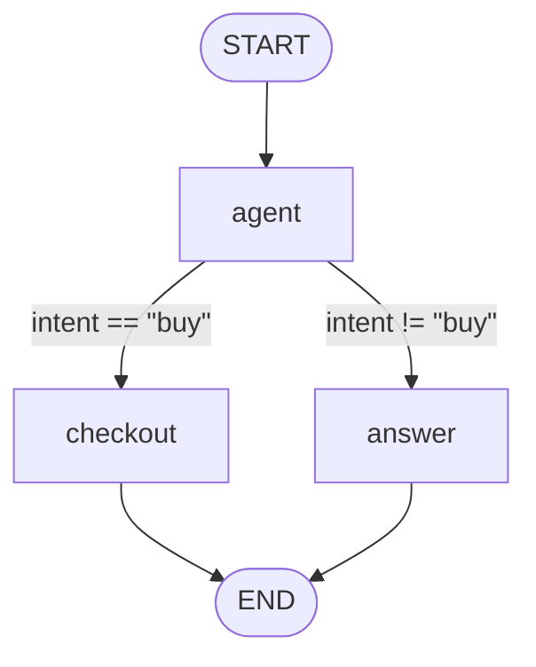

import Tabs from "@theme/Tabs";
import TabItem from "@theme/TabItem";

# Graphs as data

*Normative: [MODEL.md §9](/reference/spec).*

A graph is always constructible from a serializable **spec** — normative from day
one, because retrofitting it is expensive. This is the foundation for a
drag-and-drop builder: a CRUD app over a JSON document plus a registry browser.
Nothing in the engine knows the builder exists.

The stored form is plain data — this JSON is the whole graph:

```json
{
  "name": "support",
  "channels": { "messages": { "reducer": "append" } },
  "nodes": [{ "id": "agent", "type": "llm", "config": { "model": "claude-opus-4-8" } }],
  "edges": [
    { "from": "__start__", "to": "agent" },
    { "from": "agent", "to": "__end__" }
  ]
}
```

Build a graph from that spec and serialize it straight back — the round-trip is a
conformance test:

<Tabs groupId="lang">
<TabItem value="ts" label="TypeScript">

```ts
import { fromSpec, toSpec, START, END } from "@ilmek/core";
import type { GraphSpec, NodeRegistry } from "@ilmek/core";
import { deepStrictEqual } from "node:assert";

/** Maps a node `type` to a factory. DB-defined graphs reference these by name. */
const registry: NodeRegistry = {
  llm: (config) => async (state, ctx) => ({ messages: [`${config.model} replies`] }),
};

/** The stored document — plain data, no executable text. */
const spec: GraphSpec = {
  name: "support",
  channels: { messages: { reducer: "append" } },
  nodes: [{ id: "agent", type: "llm", config: { model: "claude-opus-4-8" } }],
  edges: [
    { from: START, to: "agent" },
    { from: "agent", to: END },
  ],
};

const g = fromSpec(spec, registry).compile();
deepStrictEqual(toSpec(g), spec);   // round-trip is a conformance test
```

</TabItem>
<TabItem value="csharp" label=".NET (C#)">

```csharp
using Ilmek;

// Maps a node `type` to a builder. DB-defined graphs reference these by name.
var registry = new Dictionary<string, NodeBuilder>
{
    ["llm"] = config => (state, ctx) =>
        new Dictionary<string, object?> { ["messages"] = new[] { $"{config["model"]} replies" } },
};

// The stored document — plain data, no executable text.
var spec = new GraphSpec
{
    Name = "support",
    Channels = new Dictionary<string, SpecChannel> { ["messages"] = new("append") },
    Nodes = new[] { new SpecNode("agent", "llm", new Dictionary<string, object?> { ["model"] = "claude-opus-4-8" }) },
    Edges = new[] { new SpecEdge(Graph.Start, "agent"), new SpecEdge("agent", Graph.End) },
};

var g = Spec.FromSpec(spec, registry).Compile();
var rebuilt = Spec.ToSpec(g);   // GraphSpec, value-equal to spec — a conformance test
```

</TabItem>
</Tabs>

## The node registry

`type` resolves against a **node registry**: `type => (config) => nodeFn`.
Code-defined graphs register anonymous types; DB-defined graphs reference
registered ones. **The engine cannot tell the difference** — the same executor
runs both.

## Two rules keep stored graphs safe

1. **A stored spec never carries executable text.** A conditional `when` is a
   *declarative predicate* (`{ channel: "intent", eq: "buy" }`), not code — there
   is no eval path. Code-defined graphs may pass a real function; the serializer
   refuses to emit one.
2. **`toSpec()` refuses to serialize what a document cannot honestly hold** — a
   code router, an anonymous node type, a hand-written guard. If it round-trips, it
   is safe to store; if it cannot, you find out at serialize time, not at load
   time.

```json
{
  "name": "support-agent",
  "channels": { "messages": { "reducer": "append" }, "cart": { "reducer": "last_write" } },
  "nodes": [
    { "id": "agent", "type": "llm", "config": { "model": "claude-opus-4-8", "tools": ["search"] } },
    { "id": "checkout", "type": "http", "config": { "url": "…" } }
  ],
  "edges": [
    { "from": "__start__", "to": "agent" },
    { "from": "agent", "to": "checkout", "when": { "channel": "intent", "eq": "buy" } },
    { "from": "checkout", "to": "__end__" }
  ]
}
```

Because the round-trip `compile(spec) → toSpec()` is a conformance test, a builder
that reads and writes this document can trust the engine to preserve exactly what
it stored.

## Visualizing a stored spec

A builder needs to show the graph it is editing. `toMermaid(spec)`
(`Spec.ToMermaid(spec)` in .NET) renders a stored spec as a Mermaid flowchart
straight from the document, with no registry and no build step. Each predicate
becomes the label of its edge:

<Tabs groupId="lang">
<TabItem value="ts" label="TypeScript">

```ts
import { toMermaid, START, END } from "@ilmek/core";
import type { GraphSpec } from "@ilmek/core";

/** A stored document, straight from the builder's table. */
const spec: GraphSpec = {
  name: "support",
  channels: { messages: { reducer: "append" }, intent: { reducer: "last_write" } },
  nodes: [
    { id: "agent", type: "llm" },
    { id: "checkout", type: "http" },
    { id: "answer", type: "llm" },
  ],
  edges: [
    { from: START, to: "agent" },
    { from: "agent", to: "checkout", when: { channel: "intent", eq: "buy" } },
    { from: "agent", to: "answer", when: { channel: "intent", neq: "buy" } },
    { from: "checkout", to: END },
    { from: "answer", to: END },
  ],
};

console.log(toMermaid(spec));
```

</TabItem>
<TabItem value="csharp" label=".NET (C#)">

```csharp
using Ilmek;

// A stored document, straight from the builder's table.
var spec = new GraphSpec
{
    Name = "support",
    Channels = new Dictionary<string, SpecChannel>
    {
        ["messages"] = new("append"),
        ["intent"] = new("last_write"),
    },
    Nodes = new[] { new SpecNode("agent", "llm"), new SpecNode("checkout", "http"), new SpecNode("answer", "llm") },
    Edges = new[]
    {
        new SpecEdge(Graph.Start, "agent"),
        new SpecEdge("agent", "checkout", new SpecPredicate { Channel = "intent", Eq = "buy" }),
        new SpecEdge("agent", "answer", new SpecPredicate { Channel = "intent", Neq = "buy" }),
        new SpecEdge("checkout", Graph.End),
        new SpecEdge("answer", Graph.End),
    },
};

Console.WriteLine(Spec.ToMermaid(spec));
```

</TabItem>
</Tabs>



Rendering is pure and deterministic. A spec gives byte-identical text in both
languages, and the same text as the graph built from it. The shared fixture under
[`conformance/viz`](/reference/conformance#companion-fixtures) checks this. See
[Visualizing a graph](/model/graph#visualizing-a-graph) for how to read the
diagram, the options, and highlighting a thread.
